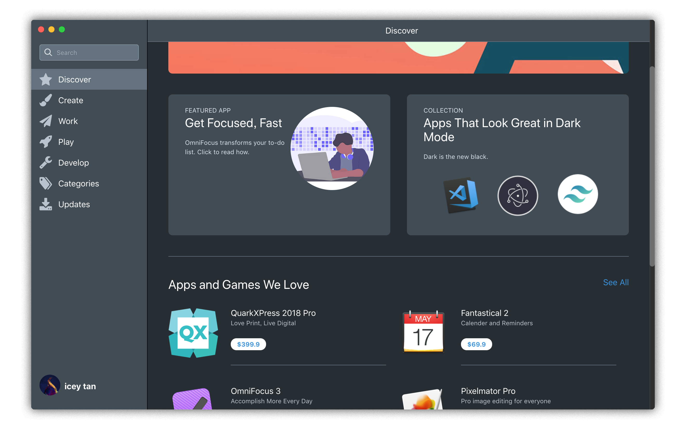

# MacOS AppStore 




## Project setup
```
npm install
```

### Compiles and hot-reloads for development
```
npm run electron:serve
```

### Compiles and minifies for production
```
npm run electron:build
```


### Notice

I have not dealt with database related stuffs. Just learn how to construct the UI. Original source comes from [drehimself/app-store-tailwind](https://github.com/drehimself/app-store-tailwind)

